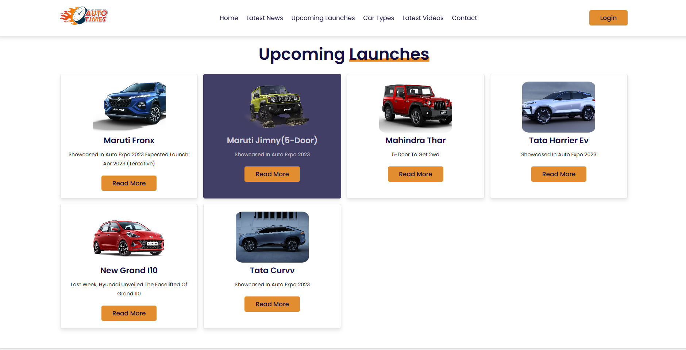
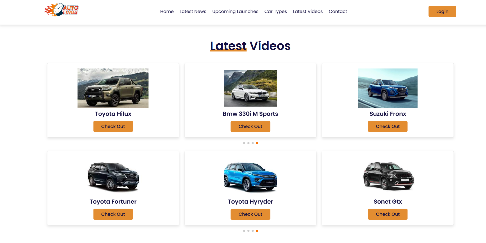
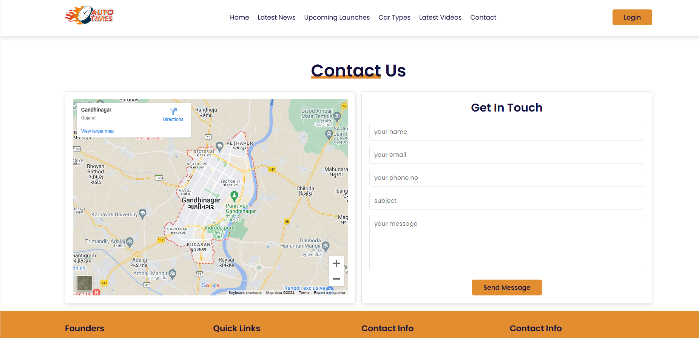

# Autotimes

## Overview
CarInfo is a web application designed to provide detailed information about various car models. The website allows users to browse through different cars, view specifications, and compare features. This project utilizes HTML, CSS, and JavaScript for the front end to create an engaging and responsive user interface.

## Features
- **Home Page:** A landing page with an overview of the website and featured car models.
- **Car Listings:** Browse through a list of car models with basic information.
- **Car Details:** View detailed specifications, images, and features of each car model.
- **Responsive Design:** Ensure a seamless experience across different devices (desktops, tablets, and mobile phones).

## Technologies Used
- **Frontend:**
  - HTML: For structuring the web pages.
  - CSS: For styling the web pages and creating a responsive design.
  - JavaScript: For dynamic interactions and client-side functionality.

## Installation

### Prerequisites
- A web browser (e.g., Chrome, Firefox, Edge)
- A text editor or IDE (e.g., VS Code, Sublime Text)

### Steps
1. **Clone the Repository:**
    ```sh
    git clone https://github.com/yourusername/carinfo-website.git
    cd carinfo-website
    ```

2. **Open the Project:**
    - Open the project folder in your text editor or IDE.

3. **Launch the Website:**
    - Open `index.html` in your web browser to view the website.

## Usage
- **Home Page:** Provides an overview and featured car models to entice users to explore further.
- **Car Listings:** Displays a list of cars with basic information such as make, model, year, and price.
- **Car Details Page:** Click on any car in the listings to view more detailed information, including specifications, images, and additional features.
- **Search Functionality:** Use the search bar to quickly find specific car models by entering relevant keywords.


## Screenshots
## Home Page

## Upcoming Launch

## Latestvideo

## Contactus



## License
This project is licensed under the MIT License. See the [LICENSE](LICENSE) file for more details.

## Contact
For any inquiries or feedback, please contact us at [hp43175@gmail.com ](mailto:hp43175@gmail.com).
